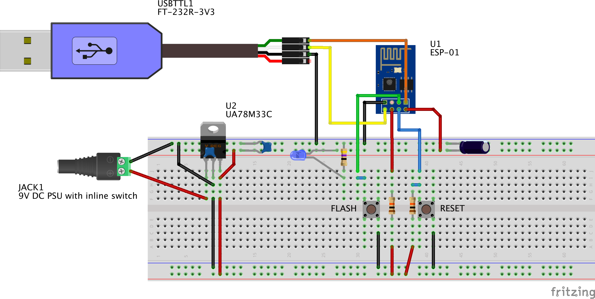
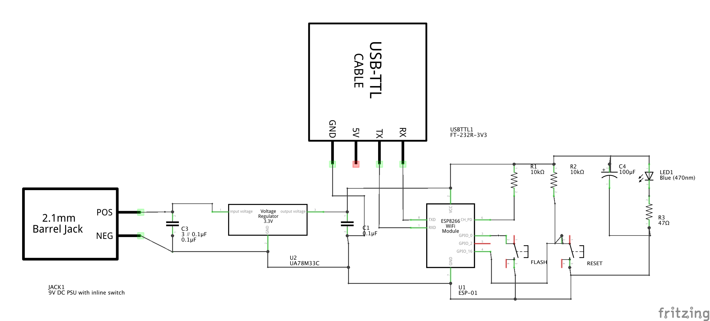

# Revision 2

Updated 21-Feb-2018

## Notes

  - Revision 2

    - Reverted to an earlier version of design, with small mod removing pull-up resistor from "FLASH" button circuit.
	  This has allowed for:
        1. More reliable firmware upload sequence
        2. Not requiring continued holding down of "FLASH" button through  upload process.
    - Use pull-up on "CH_PD" pin
    - Used two "4 pin dual-female jumper wire" for easier, quicker attachment to ESP-01 module
	  - These are not shown on schematic/breadboard images
	  - <https://www.seeedstudio.com/4-pin-dual-female-jumper-wire-300mm-(5-PCs-pack)-p-97.html>

#### Breadboard wiring diagram.

While drawn on a full-length solderless breadboard, it easily fits on a half-length breadboard.

**DO NOT plug in power supply** until everything is wired and double-checked. It is easy to fry ESP module by supplying voltages higher than 3.3V!

**DO NOT use VCC from this USB cable to connect to ESP modules!**
 1. It is 5V. Only 3.3V can be supplied to ESP module!
 2. It likely will not have sufficient power to drive your setup.

---

#### Schematic diagram

---

#### Pinout on ESP-01 ESP8266 board

VCC is 3.3V only on ALL pins!!
