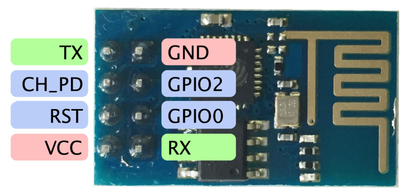

# Breadboard programmer for programming an ESP-01 Module


Use an FTDI FT-232R-3V3 USB Serial cable ([Adafruit #70](https://www.adafruit.com/product/70)) to program a common, simple ESP8266 module known as ESP-01; had purchased the USB to Serial cable  while ago from Adafruit when they still were using the genuine FTDI chip/cable.


## How to use

Using a USB serial cable and the easy-to-use ESP8266 Arduino project with Arduino IDE, you can upload programs written in Arduino environment directly to your ESP8266 module.

Before going further, here are updated design revisions:

  - **[Revision 2](Circuits_Rev2.md)** - 19-Feb-2018
    - Reverted to an earlier version of design


**RECOMMENDED**: **Revision 2**.  Recommended to use in place of circuits described below


### Hooking up the software and hardware

I use ESP8266 Arduino project to program, and test programming using included samples. See [Installing Arduino ESP8266 boards on macOS](Installing_Arduino_ESP8266_boards_on_macOS.md).

Wire up the solderless breadboard as described below. Do not yet plug in the power supply or USB cable.

  - IMPORTANT: Take careful note of precautions below to never send 5V directly to ESP module!

Once you have the Arduino software installed and everything wired up, plug in your USB TTL serial cable.

  - On macOS, there should be a serial device appearing in `/dev` with a name like `/dev/cu.usbserial-FTG9KF8Z`

In Arduino.app:

 - Go to toolbar menu item **`Tools > Board:`**
   - Select **`Generic 8266 Module`** in the 'ESP8266 Modules' section
   - All the other default options should be fine.
 - At **`Tools > Port:`** and select your USB Serial cable device.


### Testing Firmware Upload

To verify firmware programming setup and WiFi functionality, there is an  example WiFi scanning sketch.

 1. Open the WiFiScan example sketch **`File > Examples > ESP8266WiFi (in 'Examples for Generic 8266 Module') > WiFiScan`**
 1. Compile sketch in Arduino IDE by clinking the [Verify] button.
 1. Open the serial monitor in Arduino.app (click [Serial Monitor] button).
 1. Upload firmware to device:
    1. Plug in/switch on power supply to breadboard. USB cable connected already
    2. Hold down RESET button
    3. While continuing to hold down RESET button, hold down FLASH button
    4. Release RESET button
    5. Release FLASH button
    6. Click the [Upload] button in IDE
       1. Arduino will compile again
       2. Should upload firmware
       3. Should start WiFi scanning in Serial Monitor window!

```
scan start
scan done
16 networks found
1: xfinitywifi (-84)
2: Linoma (-79)*
3: NETGEAR07 (-85)*
[...]
```


## Circuits

I used Fritzing to diagram up this project before wiring it up... Read the [Parts](#parts) section below for additional details.

Fritzing source: Download [[Programming_ESP-01_rev1.fzz](https://github.com/idcrook/esp8266-playground/raw/master/Breadboard_Programmer_USB_TTL_FT232R_3v3/Programming_ESP-01_rev1.fzz)]

---

#### Breadboard wiring diagram.

While drawn on a full-length solderless breadboard, it easily fits on a half-length breadboard.

**DO NOT plug in power supply** until everything is wired and double-checked. It is easy to fry ESP module by supplying voltages higher than 3.3V!

**DO NOT use VCC from USB cable!**
 1. It is 5V. Only 3.3V can be supplied to ESP module!
 2. It likely will not have sufficient power to drive your setup.


---

#### Schematic diagram


---

#### Pinout on ESP-01 ESP8266 board



VCC is 3.3V only on ALL pins!!

---

## Parts

### Modules / ICs

  - FT-232R-3V3 USB Serial cable
    - **IMPORTANT**: Vcc on this cable is 5V -- DO NOT USE TO POWER ESP-01 module directly! ESP8266 is ONLY 3.3V safe. Leave VCC of this cable unconnected!

  - UA85M33C LDO 3.3V regulator
    - For a portable application using a 5V USB power bank, a 5.0V -> 3.3V regulator would be better, something like AMS1117 or LD1117

  - 9V/650mA wall wart power supply
    - Will be connected to an LDO voltage regulator to get a 3.3V supply for the ESP module
    - Power supply output voltage in range of 6.5V to 12V should work too
    - 5V barely sufficient for particular LDO voltage regulator I had, which has a 1.7V dropout voltage. YMMV, as there are many lower drop-out voltage LDOs available. Basically I used a PSU I had and checked out datasheet for as efficient operation on LDO as possible.

  - ESP-01 module, such as [ESP8266 ESP-01 Remote Serial Port WIFI Transceiver Wireless Module](https://www.banggood.com/ESP8266-Remote-Serial-Port-WIFI-Transceiver-Wireless-Module-p-947259.html?rmmds=search&cur_warehouse=CN)

### Electrical components

  - [Female DC Power adapter - 2.1mm jack to screw terminal block](https://www.adafruit.com/product/368)
    - *OPTIONAL*: 2.1mm barrel jack extension with inline switch; handy for powering on and off your circuit
  - Two (2) 6mm breadboard-friendly momentary, push-button switches
  - Four (4) 0.1 µF ceramic capacitors
  - Two (2) ~10 kOhm resistors for pull-ups on switches
  - breadboarding supplies
    - half-height breadboard
    - breadboard jumper wires
    - various combos of male-female, male-male, and female-female jumper cables
  - *OPTIONAL*: LED light to display when board is powered powered
    - 3mm LED
    - ~47 Ohm resistor for LED current limiting
  - *OPTIONAL*: ~100 µF capacitor for 3.3V supply filtering
    - Did not seem to be required for programming


### Tools

 - Computer as Arduino host, such as a Mac running macOS
 - Small needle nose pliers to aid solderless breadboard wire insertions
 - Magnifying glass to read part names and text
 - Digital multimeter to measure supplies and check continuity
 - *OPTIONAL*: Screwdriver with small driver to screw down wires in barrel jack adapter


## Resources

may have consulted these:

 - <https://www.diyhobi.com/flash-program-esp-01-using-usb-serial-adapter/>
 - <https://www.allaboutcircuits.com/projects/flashing-the-ESP-01-firmware-to-SDK-v2.0.0-is-easier-now/>
 - <http://homecircuits.eu/blog/programming-esp01-esp8266/>
 - <https://learn.adafruit.com/esp8266-temperature-slash-humidity-webserver?view=all>
 - <https://www.iot-experiments.com/flashing-esp8266-esp01/>
 - <https://www.hackster.io/harshmangukiya/program-esp8266-esp-01-with-arduino-ide-efb05f>
