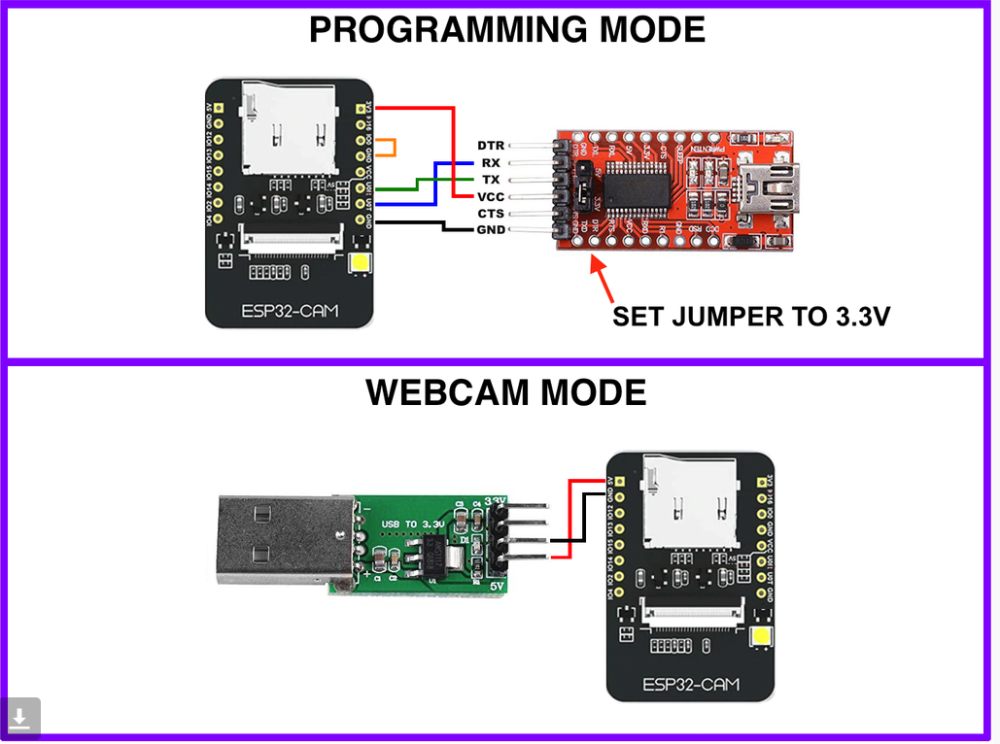

# ESP32-CAM details


| name      | desc                      | flash  | mfg | chip         | MAC     |
|-----------|---------------------------|--------|-----|--------------|---------|
| ESP32-CAM | incl. 2MP camera          | 4 MB   | 20  | ESP32-D0WDQ6 | %:eb:54 |


**ESP32-CAM**

 - Chip is ESP32-D0WDQ6 (revision 1)
 - Features: WiFi, BT, Dual Core, 240MHz, VRef calibration in efuse, Coding Scheme None
 - The module can accept 5V VCC (generally needed for webcam operation)
   - programming using 3.3V VCC recommended (3.3V is **required** for ESP32 pins, including UART pins)



Useful commands

```shell
esptool.py --port /dev/ttyUSB1 --no-stub --after no_reset flash_id
```

The `--after no_reset` only has an effect if RTS pin was available/routed.
